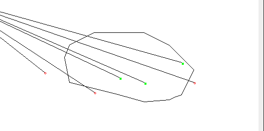

# DeadMensShot

My solution for codingame puzzle.

Creates the polygon from input points, then finds out if each 'shot' is in or out of its bounds.

as a bonus draws given polygon, inner, outer points and rays

<ul>
    <li>
        <a href="https://www.codingame.com/ide/puzzle/dead-mens-shot">Puzzle description</a>
    </li>
    <li>
        <a href="https://en.wikipedia.org/wiki/Point_in_polygon">Point in polygon wiki</a>
    </li>
    <li>
        <a href="https://www.topcoder.com/thrive/articles/Geometry%20Concepts%20part%202:%20%20Line%20Intersection%20and%20its%20Applications">Geometry concepts</a>
    </li>
    <li>
        <a href="https://stackoverflow.com/a/218081/12645536">Problem description by Mecki</a>    
    </li>
    <li>
        <a href="https://learn365project.com/2015/08/01/why-do-computer-coordinates-start-from-the-upper-left-corner/">Why computer science coordinates start from the upper left corner?</a>
    </li>
    </ul>
